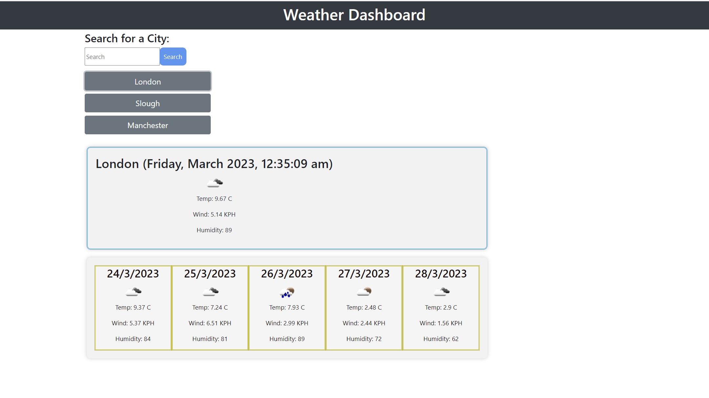

# WeatherDashboard

## Description

This is a weather dashboard that allows the user to search for a city and see the current weather conditions and a 5-day forecast. The user can also view the weather conditions of previously searched cities. The weather data is retrieved from the OpenWeather API.

## User Story

```
AS A traveler
I WANT to see the weather outlook for multiple cities
SO THAT I can plan a trip accordingly
```

## Installation

Use the [5 Day Weather Forecast](https://openweathermap.org/forecast5) to retrieve weather data for cities. The link will take you to a guide on how to use the 5 Day Forecast API. You will need to register for an API key in order to use this API. After registering for a new API key, you may need to wait up to 2 hours for that API key to activate.

The base URL for your API calls should look like the following: `https://api.openweathermap.org/data/2.5/forecast?lat={lat}&lon={lon}&appid={API key}`.

Using `localStorage` to store the presistent data, which will capture and store the `5 Day Weathher Forecast` using the user's search history.

## Usage

The user can search for a city and see the current weather conditions and a 5-day forecast. The user can also view the weather conditions of previously searched cities.

When a user views the current weather conditions for that city they are presented with:
    *The city name
    * The date
    *An icon representation of weather conditions
    * The temperature
    *The humidity
    * The wind speed
When a user view future weather conditions for that city they are presented with a 5-day forecast that displays:
    *The date
    * An icon representation of weather conditions
    *The temperature
    * The humidity
When a user click on a city in the search history they are again presented with current and future conditions for that city.

## Screenshot

The following image shows a mock-up of the WeatherDashboard appearance and functionality:




## Credits & Resources

The following tutorials and/or references used in the project:

* README.md files provided by Bootcamp were used and can be found in the assets folder.
* Class Activities and the help of tutor assistant
* [OpenWeather API](https://openweathermap.org/api)
* [Bootstrap](https://getbootstrap.com/)

## License

MIT License; Copyright (c) 2023 Mehr-Un-Nasa Hejazi Please refer to the LICENSE in the repository for further information.
